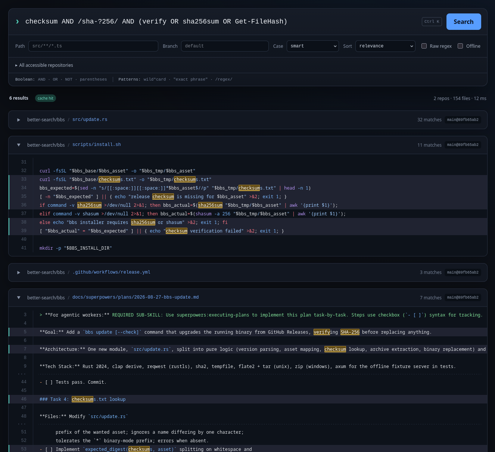

# Better Bitbucket Search



`bbs` is a fast code search tool for Bitbucket Cloud. It finds every repository your
API token can read, keeps a local copy of each one up to date, and searches them with
Boolean expressions, wildcards, PCRE2 regular expressions, path globs, relevance
ranking, and syntax-highlighted context. Search from your terminal, or run `bbs serve`
for a browser UI with the same engine behind it.

## Install

```sh
curl -fsSL https://tools.klar.ws/bbs/install.sh | sh
```

PowerShell:

```powershell
irm https://tools.klar.ws/bbs/install.ps1 | iex
```

One binary, no dependencies. Node, Rust, and Git are not required. The scripts install
to a user-local directory and verify the release checksum before writing anything. Set
`BBS_REPOSITORY`, `BBS_VERSION`, or `BBS_INSTALL_DIR` to override their defaults, or
grab an archive straight from GitHub Releases.

## Update

```sh
bbs update
```

Downloads the latest release for your platform, verifies it, and replaces the running
binary in place.

`bbs` tells you when a new version is out. To skip the notice and just get the update:

```sh
bbs auto-update on
```

A command that finds an update then installs it and carries on running on the new
version. `bbs serve` is left out, so a long-running server is never swapped out from
under you.

`bbs update --check` reports whether a newer release exists without installing it,
exiting `0` when you are current and `1` when an update is available, so it fits into a
shell prompt or a cron job.

## Authenticate

Create an Atlassian API token [here](https://id.atlassian.com/manage-profile/security/api-tokens),
scoped to Bitbucket with:

- `read:workspace:bitbucket`
- `read:repository:bitbucket`

Then run:

```sh
bbs login
```

The token is validated and saved in macOS Keychain, Windows Credential Manager, or
Linux Secret Service. It is never written to the filesystem or to Git remotes.

`bbs auth status` reports whether a credential is present without touching the network,
exiting `0` when one is and `1` when none is. Add `--verify` to check it against
Bitbucket.

For CI, set `BB_TOKEN` instead. It is used when nothing is saved, and as a fallback
when the saved credential has expired. Pass `--env-token` to prefer it outright.

## Search in your browser

```sh
bbs serve
```

That is the entire setup. It opens `http://localhost:7337` with the full search engine
already behind it. Nothing else to install, configure, or log in to.

- Repository picker with instant filtering, plus path, branch, case-mode, sort,
  raw-regex, and offline controls
- Live sync progress, then results streamed to the page
- Syntax highlighting with every match marked in place, in context
- The Boolean grammar reference sits right under the query box
- Badges telling you how fresh each result is
- Permalinks to the exact commit and line in Bitbucket
- `⌘ K` / `Ctrl K` jumps back to the query box, and a running search can be cancelled

It drives the same engine as the CLI, so a query returns identical results either way.
The server is local only and never listens on the network. Use `--port` to pick another
port, or `--no-open` to skip launching a browser.

## Use it from a coding agent

```sh
bbs skill
```

`bbs` ships an [Agent Skill](https://agentskills.io) that teaches a coding agent how to
drive the CLI: the query grammar, how to scope a search, and which flags reuse the
cache. `bbs skill` finds the agents installed on this machine and offers them in a
list. Move with the arrow keys, toggle with space, confirm with enter.

```sh
bbs skill --list                        # what bbs knows, where each copy goes
bbs skill --all                         # every detected agent, no prompt
bbs skill --harness claude-code,codex   # or name them
bbs skill --print                       # just the SKILL.md, to stdout
```

Claude Code, Codex, Cursor, opencode, Gemini CLI, GitHub Copilot, Amp, and Factory
Droid are recognised. Codex shares `~/.agents/skills` with several of the others, so
one copy covers them all.

A skill of the same name that `bbs` did not write is left alone unless you pass
`--force`.

## Search from the terminal

```sh
bbs "myClassName"
bbs "myClassName" --repos api web
bbs "myClassName" --repos team/api --path "src/server/*.js"
bbs "myVarWith*" --path "src/**/*.ts"
bbs -r '\bmyVar\.\d[A-Za-z0-9_$]*[a-z]\b'
bbs 'foo AND (bar OR baz) AND NOT generated'
bbs '"exact phrase" AND /class\s+\w+/' --branch release/2.x
```

Quote path patterns so your shell does not expand them locally.

To find out what you can search over in the first place:

```sh
bbs list repos                       # every accessible repository
bbs list repos --filter 'edge-*'     # substring, glob, or /regex/
bbs list repos -r '^team/(api|web)'  # raw PCRE2, no slashes needed
```

The filter reads like a query term: a plain substring, a `*`/`?` glob, or a `/regex/`
with the usual `icsmx` flags. It is matched against each repository's slug,
`workspace/slug`, and display name. `bbs repos` is shorthand for the same command.

Query rules:

- `NOT` binds before `AND`, which binds before `OR`. Operators are uppercase only, so
  `and`/`or`/`not` stay searchable words.
- Boolean expressions are evaluated per file, so `foo AND bar` finds a file containing
  both, however far apart they sit.
- Multiple positional query expressions are ORed and deduplicated.
- Bare and quoted terms are literal, with `*` and `?` wildcards.
- `/.../` is a PCRE2 atom inside a Boolean expression; `-r` treats each complete query
  as raw PCRE2.
- `/.../` accepts trailing `i`, `s`, `m`, and `x` flags, so `/foo.*bar/s` spans lines.
- Wildcards stay on one line, and `.` in a regex excludes newlines. `-M`/`--multiline`
  lets both cross line breaks, matching lazily so a wildcard stops at the nearest hit
  rather than the last one in the file.
- Matching is smart-case by default; use `-i` or `-s` to override it.
- `-w`/`--word` requires a word boundary either side of every term, without the case
  surprises of writing `/\bfoo\b/` by hand.
- A query needs at least one positive term: `NOT x` alone is refused, `foo AND NOT x`
  is fine.
- A pattern that matches everywhere (`""`, `//`, `*`, `?`) is refused rather than run.
- `--path` accepts Git-style `*`, `?`, character classes, and recursive `**` globs. A
  pattern with no `/` matches at any depth; `./x` anchors it to the root.
- `--exclude-path`, a leading `!` in `--path`, and `--no-vendor` remove paths. `NOT`
  only ever excludes on content.
- `--sort`, `--max-results`, `--context`, `-l` and `--count` change only what is shown,
  so they never trigger a rescan.
- Files larger than 10 MiB are skipped, and the summary says how many.
  `--max-file-size 32M` (or `none`) reaches them; `max_file_bytes` in `config.toml`
  moves the default.
- Repositories with no commits, or without the requested branch, are skipped with a
  warning rather than failing the search.
- Searches sync every selected repository before scanning. `--max-age 5m` reuses
  anything fetched recently; `--offline` searches the last cached copies.

For scripting: `--format json`, `--format jsonl`, `--sort`, `--max-results`,
`--context`, and `--no-cache`. Exit status is `0` for matches, `1` for no matches, and
`2` for errors.

See [docs/usage.md](docs/usage.md) for the full reference: query grammar, scoping,
output, ranking, freshness, cache, and configuration.

## Warm up first

```sh
bbs warmup
```

The first search on a large workspace pays for finding every repository and cloning it.
`bbs warmup` frontloads that, so the next query starts searching right away. Scope it
with `--repos` and `--branch` exactly as a search, and add `--max-age 6h` so a repeated
or scheduled run refetches only what has gone stale.

## Cache and privacy

Repository copies and past results are cached in the standard cache directory for your
platform. Results are invalidated automatically when a repository changes, so you never
see a stale hit without being told.

```sh
bbs cache status
bbs cache prune
bbs cache clear-results
bbs list repos --offline
```

`prune` leaves the next search cold; `bbs warmup` puts it back.

Only tracked UTF-8 text files are searched. Binary files, Git metadata, submodule
contents, and Git LFS payloads are excluded in v1.

## Development

Requirements are current stable Rust and Node.js 22 or newer.

```sh
npm --prefix web ci
npm --prefix web run build
cargo test
cargo run -- "query" --offline
```

The live integration harness can use `BB_TOKEN`; local `.env` files are ignored and no
test prints credentials. See [docs/architecture.md](docs/architecture.md) for the data
flow and trust boundaries.

## License

MIT
